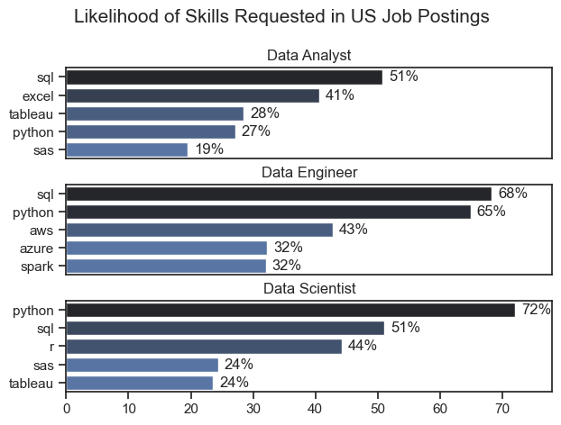
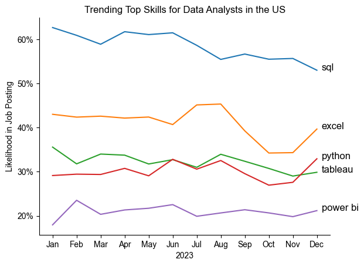
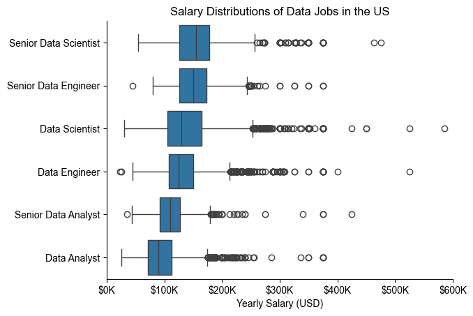
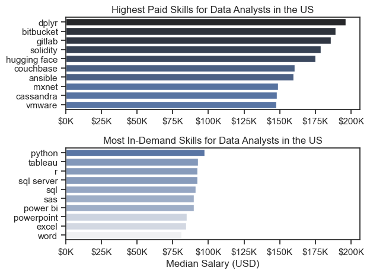
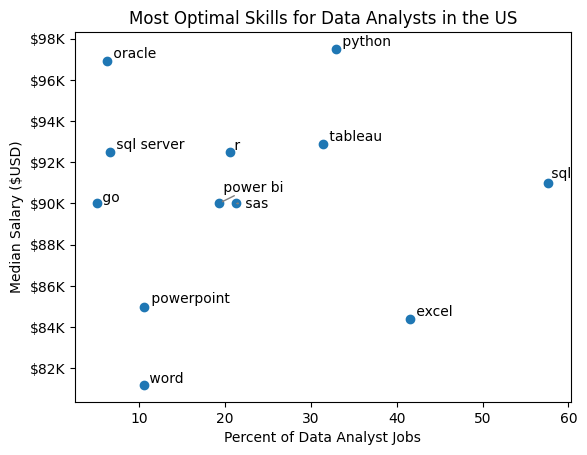
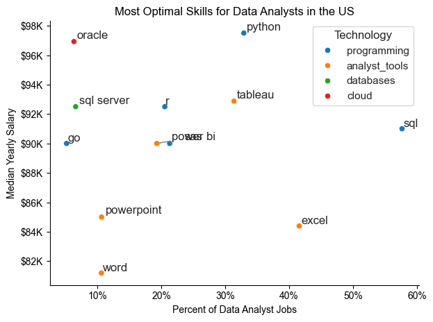

# 📊 Data Science Job Market Analysis

## Overview

Welcome to my analysis of the data job market, focusing on data analyst roles. This project was created out of a desire to navigate and understand the job market more effectively. It delves into the top-paying and in-demand skills to help find optimal job opportunities for data analysts.

The data, sourced from a dataset by Luke Barousse, provides a foundation for my analysis, containing detailed information on job titles, salaries, locations, and essential skills. Through a series of Python scripts, I explore key questions such as the most demanded skills, salary trends, and the intersection of demand and salary in data analytics.

---

## The Questions

Below are the questions I want to answer in my project:

1. **What are the skills most in demand for the top 3 most popular data roles?**
2. **How are in-demand skills trending for Data Analysts?**
3. **How well do jobs and skills pay for Data Analysts?**
4. **What are the optimal skills for data analysts to learn?** (High Demand AND High Paying)

---

## Tools I Used

For my deep dive into the data analyst job market, I harnessed the power of several key tools:

- **Python**: The backbone of my analysis, allowing me to analyze the data and find critical insights. I also used the following Python libraries:
  - **Pandas**: For data analysis.
  - **Matplotlib**: For data visualization.
  - **Seaborn**: For advanced visuals.
- **Jupyter Notebooks**: To run Python scripts and include notes and analysis.
- **Git & GitHub**: For version control and sharing code and analysis.

---

## Data Preparation and Cleanup

This section outlines the steps taken to prepare the data for analysis, ensuring accuracy and usability.

### Import & Clean Up Data

```python
import ast
import pandas as pd
import seaborn as sns
from datasets import load_dataset
import matplotlib.pyplot as plt  

# Loading Data
dataset = load_dataset('lukebarousse/data_jobs')
df = dataset['train'].to_pandas()

# Data Cleanup
df['job_posted_date'] = pd.to_datetime(df['job_posted_date'])
df['job_skills'] = df['job_skills'].apply(lambda x: ast.literal_eval(x) if pd.notna(x) else x)
```

### Filter US Jobs

To focus my analysis on the U.S. job market, I apply filters to the dataset, narrowing down to roles based in the United States.

```python
df_US = df[df['job_country'] == 'United States']
```

---

## The Analysis

Each Jupyter notebook for this project investigates specific aspects of the data job market. Here’s how I approached each question:

### 1. What are the most demanded skills for the top 3 most popular data roles?

To find the most demanded skills for the top 3 most popular data roles, I filtered out those positions by popularity and got the top 5 skills for these roles. This highlights the most popular job titles and their top skills.

View my notebook with detailed steps here: **2_Skill_Demand**.

#### Visualize Data

```python
fig, ax = plt.subplots(len(job_titles), 1)

for i, job_title in enumerate(job_titles):
    df_plot = df_skills_perc[df_skills_perc['job_title_short'] == job_title].head(5)[::-1]
    sns.barplot(data=df_plot, x='skill_percent', y='job_skills', ax=ax[i], hue='skill_count', palette='dark:b_r')

plt.show()
```



#### Insights

- **SQL** is the most requested skill for Data Analysts and Data Scientists, appearing in over half the job postings for both roles.
- Data Engineers require more specialized technical skills (AWS, Azure, Spark) compared to Data Analysts and Data Scientists, who are expected to be proficient in more general data management and analysis tools (Excel, Tableau).
- **Python** is highly demanded across all three roles, especially for Data Scientists (72%) and Data Engineers (65%).

---

### 2. How are in-demand skills trending for Data Analysts?

To find how skills are trending in 2023 for Data Analysts, I filtered data analyst positions and grouped the skills by the month of the job postings.

View my notebook with detailed steps here: **3_Skills_Trend**.

#### Visualize Data

```python
from matplotlib.ticker import PercentFormatter

df_plot = df_DA_US_percent.iloc[:, :5]
sns.lineplot(data=df_plot, dashes=False, legend='full', palette='tab10')

plt.gca().yaxis.set_major_formatter(PercentFormatter(decimals=0))
plt.show()
```



#### Insights

- **SQL** remains the most consistently demanded skill throughout the year, though it shows a gradual decrease in demand.
- **Excel** experienced a significant increase in demand starting around September, surpassing both Python and Tableau by year-end.
- **Python** and **Tableau** show relatively stable demand, while **Power BI** shows a slight upward trend towards the year's end.

---

### 3. How well do jobs and skills pay for Data Analysts?

To identify the highest-paying roles and skills, I focused on US jobs and looked at their median salary. I also examined salary distributions of common data jobs.

View my notebook with detailed steps here: **4_Salary_Analysis**.

#### Visualize Data

```python
sns.boxplot(data=df_US_top6, x='salary_year_avg', y='job_title_short', order=job_order)

ticks_x = plt.FuncFormatter(lambda y, pos: f'${int(y/1000)}K')
plt.gca().xaxis.set_major_formatter(ticks_x)
plt.show()
```


#### Insights

- There's significant variation in salary ranges across job titles. Senior Data Scientist positions have the highest salary potential, up to $600K.
- Senior Data Engineer and Senior Data Scientist roles show more high-end outliers, while Data Analyst roles have more consistent salaries.
- Median salaries increase with seniority and specialization.

#### Highest Paid & Most Demanded Skills for Data Analysts

I narrowed my analysis to data analyst roles and looked at the highest-paid and most in-demand skills.

#### Visualize Data

```python
fig, ax = plt.subplots(2, 1)  

# Top 10 Highest Paid Skills for Data Analysts
sns.barplot(data=df_DA_top_pay, x='median', y=df_DA_top_pay.index, hue='median', ax=ax[0], palette='dark:b_r')

# Top 10 Most In-Demand Skills for Data Analysts
sns.barplot(data=df_DA_skills, x='median', y=df_DA_skills.index, hue='median', ax=ax[1], palette='light:b')

plt.show()
```


#### Insights

- Specialized technical skills like **dplyr**, **Bitbucket**, and **Gitlab** are associated with higher salaries, some reaching up to $200K.
- Foundational skills like **Excel**, **PowerPoint**, and **SQL** are the most in-demand, though they may not offer the highest salaries.
- There's a distinction between the highest-paid and most in-demand skills. Data analysts should develop both high-paying specialized skills and widely demanded foundational skills.

---

### 4. What are the most optimal skills to learn for Data Analysts?

To identify the most optimal skills to learn (highest paid and highest in demand), I calculated the percent of skill demand and the median salary of these skills.

View my notebook with detailed steps here: **5_Optimal_Skills**.

#### Visualize Data

```python
from adjustText import adjust_text
import matplotlib.pyplot as plt

plt.scatter(df_DA_skills_high_demand['skill_percent'], df_DA_skills_high_demand['median_salary'])
plt.show()
```


#### Insights

- **Oracle** has the highest median salary (~$97K), despite being less common in job postings.
- Common skills like **Excel** and **SQL** are prevalent but have lower median salaries compared to specialized skills like **Python** and **Tableau**.
- **Python**, **Tableau**, and **SQL Server** offer higher salaries and are fairly common in job listings.

---

### Visualizing Different Technologies

Let's visualize the different technologies in the graph, adding color labels based on the technology (e.g., Programming: Python).

#### Visualize Data

```python
from matplotlib.ticker import PercentFormatter

# Create a scatter plot
scatter = sns.scatterplot(
    data=df_DA_skills_tech_high_demand,
    x='skill_percent',
    y='median_salary',
    hue='technology',  # Color by technology
    palette='bright',  # Use a bright palette for distinct colors
    legend='full'      # Ensure the legend is shown
)
plt.show()
```


#### Insights

- Programming skills tend to cluster at higher salary levels.
- Database skills (e.g., **Oracle**, **SQL Server**) are associated with some of the highest salaries.
- Analyst tools (**Tableau**, **Power BI**) are prevalent and offer competitive salaries.

---

## What I Learned

Throughout this project, I deepened my understanding of the data analyst job market and enhanced my technical skills in Python, especially in data manipulation and visualization.

- **Advanced Python Usage**: Leveraged Pandas, Seaborn, and Matplotlib for complex data analysis.
- **Data Cleaning Importance**: Thorough data cleaning is crucial for accurate insights.
- **Strategic Skill Analysis**: Aligning skills with market demand is key for career planning.

---

## Challenges I Faced

- **Data Inconsistencies**: Handling missing or inconsistent data required careful cleaning.
- **Complex Data Visualization**: Designing effective visuals for complex datasets was challenging but essential.
- **Balancing Breadth and Depth**: Maintaining a broad overview while diving deep into analysis required constant balancing.

---

## Conclusion

This exploration into the data analyst job market has been incredibly informative, highlighting the critical skills and trends that shape this evolving field. The insights enhance understanding and provide actionable guidance for anyone looking to advance their career in data analytics. As the market continues to change, ongoing analysis will be essential to stay ahead. This project is a good foundation for future explorations and underscores the importance of continuous learning and adaptation in the data field.
